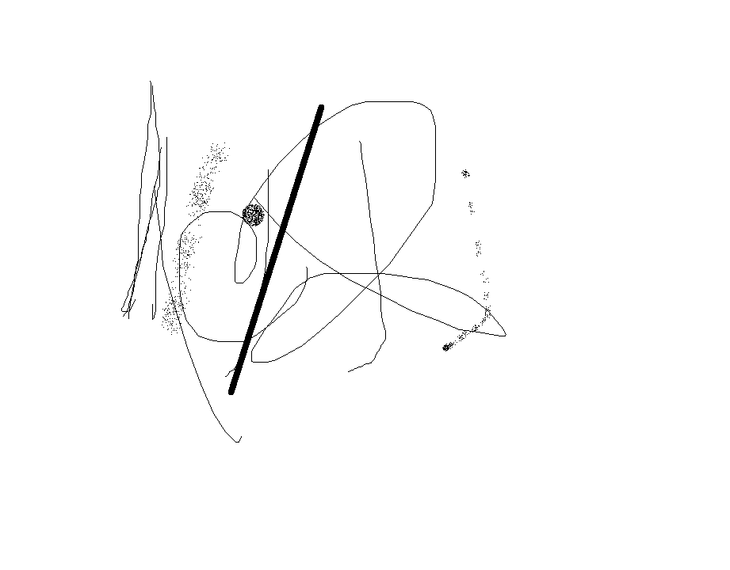

# 普通字体及特殊字体
普通
**黑体**
*斜体*
***黑斜体***
~~带删除线~~

## 引用
>这里是引用的内容bulabula
bulabula
>>这是引用的内容
### 分割线
---
***
#### 超链接

[baidu](https://www.baidu.com "baidu")
##### 列表
###### 无序列表
- 条目1
+ 条目2
* 条目3
###### 有序列表
1. 列表1
2. 列表2
3. 列表3
###### 列表嵌套
上一级和下一级之间敲三个空格即可
- 无序列表10
   - 无序列表20
      - 无序列表30
   - 无序列表21
   - 无序列表22
- 无序列表11
   1. 有序列表1
   2. 有序列表2
##### 表格
姓名|技能|排行
--|:--:|--:
刘备|哭|大哥
关羽|打|二哥
张飞|骂|三弟
##### 代码
`print('hello world')`

```
def add(x,y):
    return x+y
```

# 公式
## 1. 行内与独行
算法的复杂度为$O(n)$
$$这是一行单独的公式O(logn)$$
## 2. 上标、下标与组合
$x^4$,$e^{xy}$
$x_1$,$x_1^y$
${16}_{8}O{2+}_{2}$
